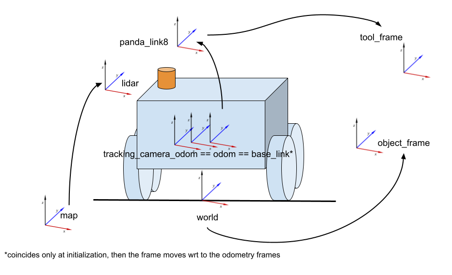
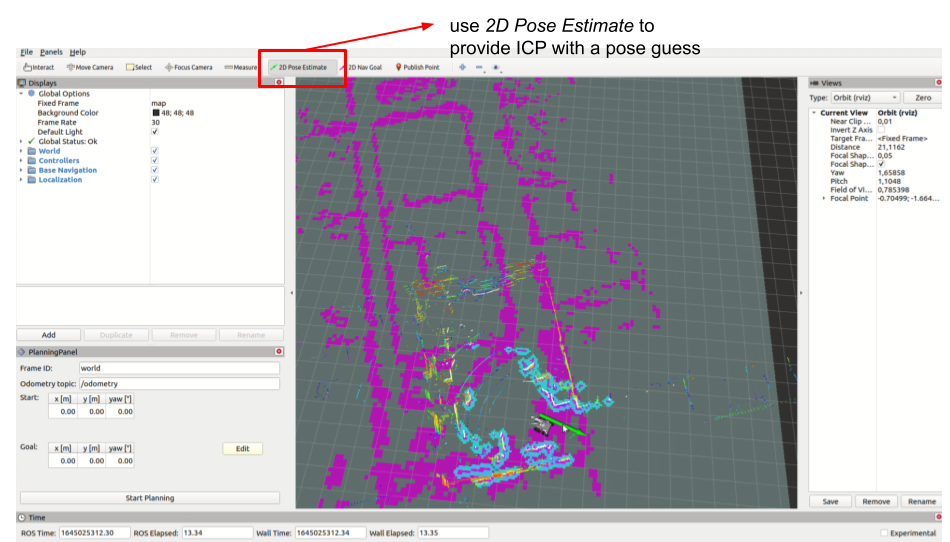
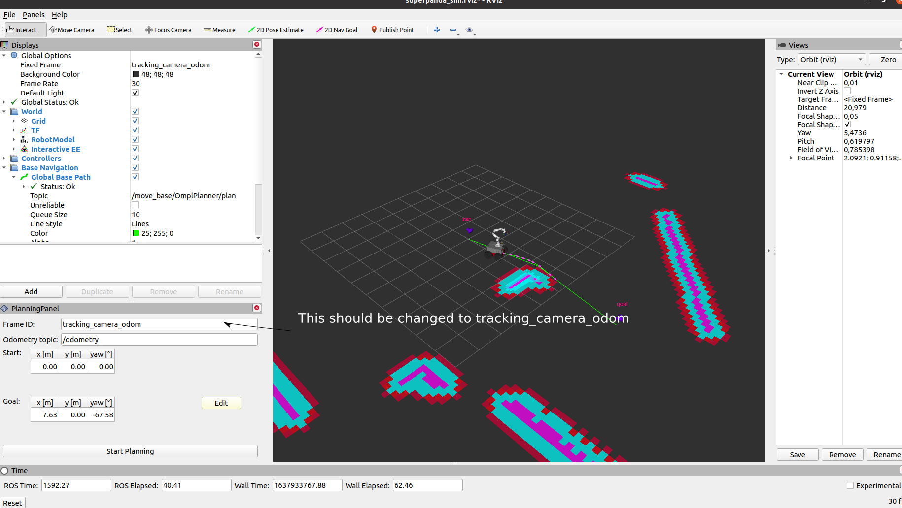
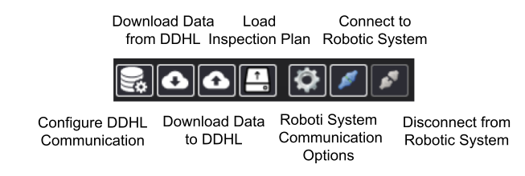
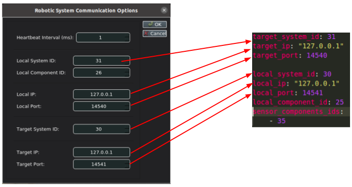

# piloting_demo

Documentation to install and run all the software necessary for simulation and deployment of the piloting demo.

## Index

- [Installation](#installation)
- [TL; DR](#tl-dr)
- [A detour on frames and their meaning](#a-detour-on-frames-and-their-meaning)
- [Networking](#networking)
- [Operator](#operator)
- [Mapping](#mapping)
  - [Step 1: offline mapping](#step-1-offline-mapping)
  - [Step 2: map generation](#step-2-map-generation)
  - [Step 3: costamap generation](#step-3-costmap-generation)
- [Localization and Navigation](#localization-and-navigation)
  - [Simulation](#simulation)
  - [Real Robot](#real-robot)
- [ground Robot Control Station](#ground-robot-control-station-grcs)
- [State Machine](#state-machine)
- [Running the Demo](#running-the-demo)

## Installation

In order to run the simulation the SMB stack needs to be cloned. This is reflected in the `moma_piloting.repos` which should be merged using vcstool.

1. Merge the package dependencies with vcstool from the `src` directory of your catking workspace
   ```
   vcs import --input moma/moma_piloting.repos
   ```
   If you need to also install packages for SLAM, you need additional dependency for the `smb_slam` package. These can be installed running:
   ```
   vcs import --input https://raw.githubusercontent.com/cartographer-project/cartographer_ros/master/cartographer_ros.rosinstall
   ```
2. Update dependencies of the smb stack through rosdep:

   ```
   rosdep install --from-paths src --ignore-src --skip-keys="pinocchio" -r -y
   ```

   We skip `pinocchio` as we rely on a custom installation which enables the collision detection. Refer to [the installation script](../../install_dependencies.sh) for further information on the installation procedure.

3. At the moment, rosdep does not find some of the packages required in the smb stack. Then it is necessary to iterate the build process and install all missing packages with `sudo apt-get install ros-noetic-<pkgname>` until all packages were resolved. This is an annoying procedure, that we could improve changing the smb stack at a later stage.

4. Install the [`mavsdk-piloting`](https://github.com/fada-catec/piloting-mavsdk) package:

   - Download and install the repo outside of the catkin workspace:
     ```
     git clone https://github.com/fada-catec/piloting-mavsdk
     cd piloting-mavsdk
     mkdir install
     mkdir build && cd build
     cmake .. -DCMAKE_INSTALL_PREFIX=<path-to-piloting-mavsdk>/install
     make -j4
     make install
     ```
   - Add the install path to the environment variables (better add this line to the `.bashrc`):
     ```
     export LD_LIBRARY_PATH=<path-to-piloting-mavsdk>/install/lib:$LD_LIBRARY_PATH
     export CMAKE_PREFIX_PATH=<path-to-piloting-mavsdk>/install:$CMAKE_PREFIX_PATH
     ```

5. Build the `piloting_demo` package (see above point if something goes wrong) from whithin the catkin workspace.
   ```
   catkin build piloting_demo
   ```

## TL; DR

In the following sections we describe the components of the `piloting_demo`, how to run navigation, localization, planning and manipulation separately.
During the actual demo, some launch files will be provided that do all the job for you and make sure that the correct stuff is running. To run a full demo go to the [demo section](#running-the-demo). As we havily rely on the RobotX Summer School software stack, a more in depth treatments of topics and more information is availabel in the [Summer School documentation webpage](https://ethz-robotx.github.io/SuperMegaBot/rss-tutorials/).

## A detour on frames and their meaning

It is non-trivial to get all the frames right for such a demo. Many frames are involved. Here we review the main ones and what their meaning is in simulation and real world experiments:

- `base_link`: the origin of the robot kinematic chain. Is specified in the center of the moving base, with the x axis poining forward.
- `map`: the frame used by localization to align with respect to the global map (aka a pre-loaded point cloud of the environment). In real experiments, global information should be defined in this frame since this is the frame which is supposed to stay consistent over time. For example,a target goal for the base is expressed in this frame.
- `tracking_camera_odom`, `odom`: these are the links with respect to wich we publich the base odometry. As in MPC the kinematic chain starts at the `base_link`, the odometry coming from here is an odometry source that can be used straight away as base position measurements. How do we obtain an odometry at the base link (more or less at the geometrical center of the robot) if there is no odometry sensor in there?
  - _simulation_: in simulation, the odometry plugin is located at the same location of the tracking camera frame (which is not in the base). This allows 0-shot sim to real. Nevertheless, a node called `odometry_conversion_node` is used to convert this odometry to position/velocity measurements centered at the base link (like the sensor would be in the base link) allowing controllers to subscribe to this topic instead. The node reads the static transfrom from the sensor location to the base link and uses that to translate twist and position odometry measurements
  - _real world_: same setup as in simulation, but a real Realsense Tracking cam is publishing the desired measurements. Note that we still need the `odometry_conversion_node` to run.
- `world`: this frame allows to represent ground truth in simulation and not have to run the localization pipeline. The world corresponds to the ground truth position of the robot. In other words, one can say that if the localization pipeline would be flawless, the two frames should coincides.
  - _simulation_: in sim `world` means where Gazebo thinks objects are. Unfortunately is not Gazebo that publishes all transformations with respect to its internal notion of world but its us, using some `static_transform_publish` or simple `/tf` topics. We are therefore free to choose the notion of world as long as we are consistent? Not really, because gazebo plugins (e.g camera that publish some point cloud) have embed this internal gazebo notion of world. As we have no power about that, we have to agree and change some plugin to publish the transform that links our robot to `world`. This is currently supported in the odometry gazebo plugin spawned inside the smb.
  - _real world_: in real robot experiments there is no such thing as `world` but only a `map` (output from localization pipeline) and `odom` (or `tracking_camera_odom`). In this case, we are allowed to use a custom published transform from `world` to `map` (e.g identity).
- `panda_link8`: last link of panda arm, right before the end effector
- `tool_frame`: accessory frame used as the target end effector pose for manipulation tasks
- `object_frame`: ground truth location or estimation of the object pose (should be wrt `map` or `world` frames).



**Important Remark**: the tf tree might not look as one would always expect with the root being world, and all other frames, logically placed in the tree path. This is bacause of the constraint imposed by `tf_ros` that the transforms cannot have more then a parent node (it must be a tree).

## Networking

TODO

## Operator

In order to allow the operator to inspect the robot state, set goals, and visualize sensor information we provide a dedicated launch that always run on the operator pc.

- _simulation_: no particular care must be taken as everything run locally
- _real robot_: make sure that the operator pc is networked to the common robot networks and that a single ros core is already running on the smb computer. Referent to the [networking section](#networking) for troubleshooting possible networking issues.
  Run the operator pc to visualize sensor stram and interact with the robot:

```
roslaunch piloting_demo operator_pc.launch
```

## Mapping

### Important note

Before reading the rest of this section, be careful about consistency of the robot description among these packages. Slam and localization require the relative transforms between lidar and other odometry sources, such at the imu and the tracking camera. Both offline mapping and map generation (step 1 and 2 in the following) point to a urdf file which is statically generated and placed in `smb_slam/config/smb_cartographer/<name-urdf>.urdf`. Make sure that this is consistent with the current version of the robot

Mapping relies on the `cartographer_ros` package which is wrapped by `smb_slam`. We first navigate (manually) and collect a rosbag of the required sensors.
Use the bash script available in the smb home folder for that (`smb_common/record_sensors.sh`). Then we run a offline mapping session based on these data.

### Step 1: offline mapping

Terminal #1

```
roslaunch smb_slam mapping_offline_ct.launch bag_filename:=<full-path-to-bag-file>
```

Terminal #2 (visualization): note that RViz will complain that the transform to the map is not available. Dont worry, the warning will disappear as soon as the mapping node will publish the first transform, which takes some time (< 1m).

```
roslaunch smb_slam cartographer_rviz.launch
```

### Step 2: map generation

The genereted pose graph, can be consumed to post-process and optimize a global map which is written to a .pcd file. The output of the following command will be a full and decimated point cloud together with some informative screenshots of the map from different viewering angles.

```
roslaunch smb_slam assets_writer_ct.launch \
  bag_filenames:=<full-path-to-bag-file> \
  pose_graph_filename:=<full-path-to-bag-file>.pbstream \
  map_name:=map
  output_file_prefix:=<path-to-save-directory>
```

If the bag is `/home/bags/test.bag` and this has been processed as in step 1, a `/home/bags/test.bag.pbstream` should be saved. Then an example command could be

```
roslaunch smb_slam assets_writer_ct.launch \
  bag_filenames:=/home/bags/test.launch \
  pose_graph_filename:=/home/bags/test.bag.pbstream \
  map_name:=map output_file_prefix:=/home/maps
```

Note that the process exits with an error log (`REQUIRED process [cartographer-assets-writer-2] has died!`). This does not mean that the step failed but rather then the node is done with the processing (I know, it should just finish cleanly, but this is how it is).

### Step 3: costmap generation

Once we have our brand new, cool point cloud, we can slice it to create a 2D costmap out of it. For that we will need the `smb_naviation` package. It contains the utilities to extract extract the ground plane and then an occupancy octomap from the polished and downsampled 3D point clouds. This octomap is then projected to the ground and saved as a 2D costmap that can be used for global planning.

First navigate to the `smb_navigation` package and then execute the `pcd_to_gridmap.sh` script. It takes three arguments:

- the full path to the PCL (use the decimated one has a full PCL would take A LOT of time to process)
- the direction where the save the output map
- a boolean indicating wheter to optionally run rviz for visualization. If set to true make sure that a roscore is running

Example:\
Terminal #1:

```
roscore
```

Terminal #2

```
cd ~/piloting_ws/src/smb_path_planner/smb_navigation/script
./pcd_to_gridmap.sh /home/maps/decimated.pcd /home/maps/ true

```

The previous command will generate a `map.yaml` and `map.pgm` files in the target folder. The `map.yaml` might contain some `nan` in the origin, set it manually to zero and save.

### Step 4 (optional): Mesh generation for simulation

Generate a mesh out of the `map.pcl` file for simulation in Gazebo.
As most of the existing mesh generation software doesn't support `.pcd` files very well, run the map through [pcd2txt](https://github.com/jk-ethz/pcd2txt) using `pcd2txt map.pcd -o /outpath`.

Then, open the resulting `map.txt` file with [CloudCompare](https://www.danielgm.net/cc/) and follow [this tutorial](https://ignitionrobotics.org/api/gazebo/4.0/pointcloud.html).
For reconstructing the lab environment, it was helpful to do a Tools->Clean->SOR filter (# points 6->20) before estimating the normals and generating a mesh.

Alternatively, you can also use [MeshLab](https://www.meshlab.net/).
Here, the feature Filters->Simplification->Quadric Edge Collapse Decimation is very useful for reducing the size of the final mesh.
Also, Filters->Cleaning->Remove isolated pieces (wrt diameter) is useful to get rid of faces dangling in mid-air.

## Localization and Navigation

We localize our robot agains the prerecorded map. For this purpose we use the `smb_slam` package again. It is important in this case, to set the right map on startup. Check the [launch file](launch/navigation.launch) to know how this can be done. The robot will likely visualize with some pose offset with respect to the statically loaded map.

You can use the `2D Pose Estimate` button in RViz to provide ICP with a pose guess, and avoid localization to be trapped in some local minima.



```
roslaunch piloting_demo navigation.launch sim:=[true/false] use_global_map:=[true/false]
```

The static map is loaded and should also be visualized in RViz (purple costamp in the previous image). The costmap is retrieved from the `map_server`. This is loading the map from a `*.yaml` and `*.pgm` files stored at the output directory of step 3 in the [mapping section](#mapping). As long as the static costmap is generated from the same point cloud used for localization, these will align and allow to set a global goal for the path planner.

### Simulation

In Terminal 1 run the **gazebo simulation**:

```
roslaunch piloting_demo sim.launch
```

The last step should spawn something like this in rviz (note the additional navigation pluing):



Make sure the correct odom frame is set in the navigation panel. After that, one can click on Edit to move the 2d interactive marker to set a new base pose, and after that Start Planning to generate a global path which is then followed by the base (tracking is not perfect and the base will stop moving in a certain tolerance).

More info about the SMB navigation and control stack here: https://ethz-robotx.github.io/SuperMegaBot/.

### Real Robot

Differently from the simulation we need to make sure that the programs are running on the correct machine. In particular we have 3 main machines:

- the supermegabot pc (**smb_pc**)
- the pc connected to the arm (**panda_pc**)
- the operator pc, used for remote operation and visualization (**operator_pc**)
  We will use the shortnames for each terminal, to indicate where each command is executed. Note that the pc needs to be connected to the same ROS network and reference to the same master.

In Terminal 1 (**panda_pc**)

```
mon launch moma_robot robot_pc_panda.launch
```

In Terminal 2 (**smb_pc**)

```
mon launch moma_robot robot_pc_smb.launch
```

In Terminal 3 (**smb_pc**)

```
mon launch piloting_demo navigation.launch sim:=false use_global_map:=[true/false]
```

In Terminal 4 (**panda_pc**)

```
mon launch piloting_demo perception.launch
```

In Terminal 5 (**operator_pc**)

```
mon launch piloting_demo operator_pc.launch
```

In Terminal 6 (**operator_pc**) [Optional]

```
rosrun teleop_twist_keyboard teleop_twist_keyboard.py __ns:=keyboard_teleop
```

In Terminal 7 (**panda_pc**) [Optional]

```
roslaunch piloting_demo mission.launch standalone:=true
```

This will launch the smb and panda robot, start their controller and run the localization, navigation and perception pipeline. It will also start the state machine in standalone mode. Note that localization and navigation are against a static prebuilt map. This defaults to the `jfloor` map for the moment, but a different map can be given as argument to the launch file. Refer to the corresponding [launch file](launch/navigation.launch) for more info. The base target is set in the same way as in simulation.

## ground Robot Control Station (gRCS)

Supervision of robotics operation is managed by the ground Robot Control Station. The program in `piloting-mavsdk-ros` is a ros bridge between the control station and the robot (called _robotic engine_) such that communciation can happen via ROS on the client side (state machine) and MAV implementation details are not exposed.

The gRCS can be tested using the [docker image](https://drive.google.com/drive/folders/1YUcn2Whun1ZgzAuddewTMnQ7mcIUk6fn?usp=sharing) (tested and working in Ubuntu20). Follow the README to install and run the docker image.

The buttons in the image are the most relevant for establishing a new connection.



Once the gRCS gui is started, an inspection plan need to uploaded for a mission to start. Press on the _Load Inspection Plan_ button. The docker image should already contain a inspection file that can be used. Then The GCS can connect to the robot by specifing its ip, port and identifer. Open the connection dialog window pressing on the _Robotic System Communication Options_ button and inspect the settings. Note that the settings should match with the config file used in `piloting-mavsdk-ros` to establish the connection.



To launch the gRCS, you additionally need to launch the following.

In Terminal 1 (**panda_pc**/**operator_pc**)

```
mon launch piloting_demo mavsdk_ros.launch
```

In Terminal 2 (**panda_pc**)

```
roslaunch piloting_demo mission.launch
```

In Terminal 3 (**operator_pc**)

```
./run_grcs.sh --nvidia_drivers=False
```

## State Machine

TODO

## Running the Demo

TODO
