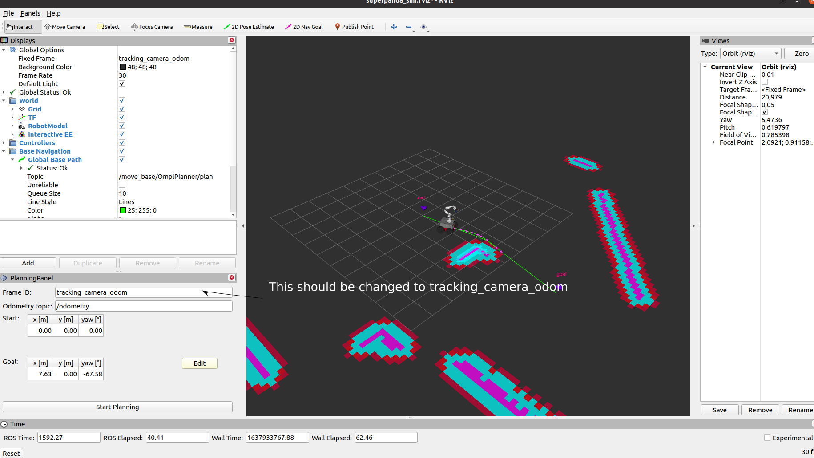
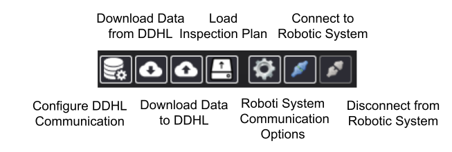
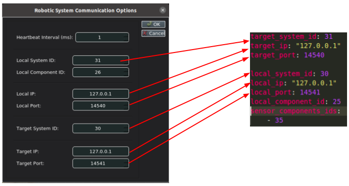

# piloting_demo

## Simulation

There are two options of running the simulation, either using a global path planner / navigation or using a whole-body MPC controller.

## Installation
In order to run the simulation the SMB stack needs to be cloned. This is reflected in the `moma_piloting.repos` which should be merged using vcstool.

1. Merge the package dependencies with vcstool from the `src` directory of your catking workspace
    ```
    vcs import --input moma/moma_piloting.repos
    ```
    If you need to also install packages for SLAM, you need additional dependency for the `smb_slam` package. These can be installed running:
    ```
    vcs import --input https://raw.githubusercontent.com/cartographer-project/cartographer_ros/master/cartographer_ros.rosinstall
    ```
2. Update dependencies of the smb stack through rosdep: 

    ```
    rosdep install --from-paths src --ignore-src --skip-keys="pinocchio" -r -y
    ```
    We skip `pinocchio` as we rely on a custom installation which enables the collision detection. Refer to [the installation script](../../install_dependencies.sh) for further information on the installation procedure.

3. At the moment, rosdep does not find some of the packages required in the smb stack. Then it is necessary to iterate the build process and install all missing packages with `sudo apt-get install ros-noetic-<pkgname>` until all packages were resolved. This is an annoying procedure, that we could improve changing the smb stack at a later stage.

5. Install the [`mavsdk-piloting`](https://github.com/fada-catec/piloting-mavsdk) package:
    - Download and install the repo outside of the catkin workspace: 
        ```
        git clone https://github.com/fada-catec/piloting-mavsdk
        cd piloting-mavsdk
        mkdir install
        mkdir build && cd build
        cmake .. -DCMAKE_INSTALL_PREFIX=<path-to-piloting-mavsdk>/install
        make -j4
        make install
        ```
    - Add the install path to the environment variables (better add this line to the `.bashrc`):
        ```
        export LD_LIBRARY_PATH=<path-to-piloting-mavsdk>/install/lib:$LD_LIBRARY_PATH
        export CMAKE_PREFIX_PATH=<path-to-piloting-mavsdk>/install:$CMAKE_PREFIX_PATH
        ```

4. Build the `piloting_demo` package (see above point if something goes wrong) from whithin the catkin workspace.
    ```
    catkin build pilotin_demo
    ```

## Path Planner / Navigation

### Simulation
In Terminal 1 run the  __gazebo simulation__: 
```
roslaunch piloting_demo superpanda_sim.launch mpc:=true
```
In Terminal 2 run the __operator pc__ (visualization + control_gui):
```
roslaunch piloting_demo superpanda_operator.launch
```
The last step should spawn something like this in rviz (note the additional navigation pluing):



Make sure the correct odom frame is set in the navigation panel. After that, one can click on Edit to move the 2d interactive marker to set a new base pose, and after that Start Planning to generate a global path which is then followed by the base (tracking is not perfect and the base will stop moving in a certain tolerance).

More info about the SMB navigation and control stack here: https://ethz-robotx.github.io/SuperMegaBot/.

### Real Robot

Differently from the simulation we need to make sure that the programs are running on the correct machine. In particular we have 3 main machines:
- the supermegabot pc (__smb_pc__)
- the pc connected to the arm (__panda_pc__)
- the operator pc, used for remote operation and visualization (__operator_pc__)
We will use the shortnames for each terminal, to indicate where each command is executed. Note that the pc needs to be connected to the same ROS network and reference to the same master. 

In Terminal 1 (__panda_pc__)
```
mon launch moma_robot robot_pc_panda.launch
```
In Terminal 2 (__smb_pc__)
```
mon launch moma_robot robot_pc_smb.launch
```
In Terminal 3 (__smb_pc__)
```
mon luanch piloting_demo navigation.launch sim:=false
```
In Terminal 4 (__operator_pc__)
```
mon launch piloting_demo operator_pc.launch
```
This will launch the smb and panda robot, start their controller and run the localization and navigation pipeline. Note that localization and navigation are against a static prebuilt map. This defaults to the jfloor map for the moment, but a different map can be given as argument to the launch file. Refer to the corresponding [launch file](launch/navigation.launch) for more info. The base target is set in the same way as in simulation.

### ground Robot Control Station (gRCS)
Supervision of robotics operation is managed by the ground Robot Control Station. The program in `piloting-mavsdk-ros` is a ros bridge between the control station and the robot (called _robotic engine_) such that communciation can happen via ROS on the client side (state machine) and MAV implementation details are not exposed.

The gRCS can be tested using the [docker image](https://drive.google.com/drive/folders/1YUcn2Whun1ZgzAuddewTMnQ7mcIUk6fn?usp=sharing) (tested and working in Ubuntu20). Follow the README to install and run the docker image. 

The buttons in the image are the most relevant for establishing a new connection.



Once the gRCS gui is started, an inspection plan need to uploaded for a mission to start. Press on the _Load Inspection Plan_ button. The docker image should already contain a inspection file that can be used. Then The GCS can connect to the robot by specifing its ip, port and identifer. Open the connection dialog window pressing on the _Robotic System Communication Options_ button and inspect the settings. Note that the settings should match with the config file used in `piloting-mavsdk-ros` to establish the connection.




