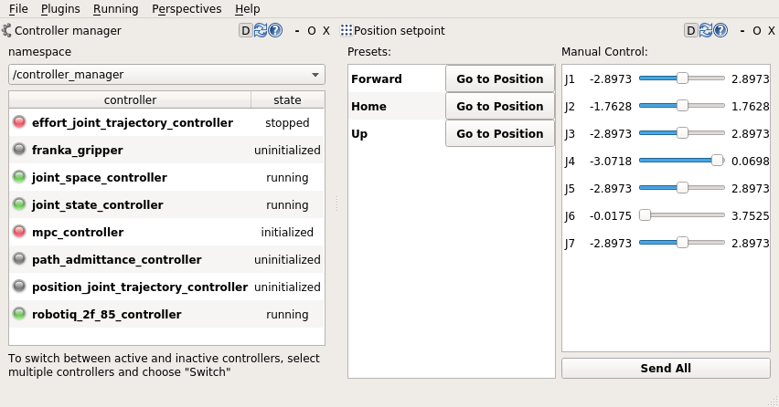

# moma_tools

A dashboard, user interfaces and tools for real-time robot state display, manual interaction and debugging.



## Installation

Install the main dashboard, which will install the other tool packages as its dependencies.
```
catkin build moma_dashboard
```

## Usage

These tools should be run as a node in the main launch file.
For example, run them as part of a Gazebo simulation.
```
roslaunch moma_gazebo panda_piloting.launch
```

---

Alternatively, run only the main dashboard, which bundles all relevant tool interfaces in a common and consistent Qt perspective view.
However, ensure that the controller manager is started and that `moman_joint_space_controller` and `moma_joint_velocity_controller` are loaded beforehand.
```
roslaunch moma_dashboard dashboard.launch
```